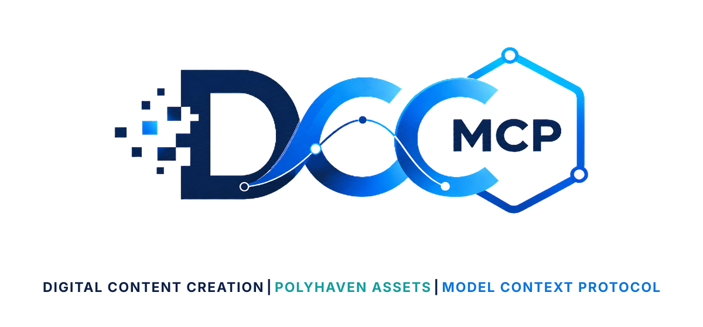
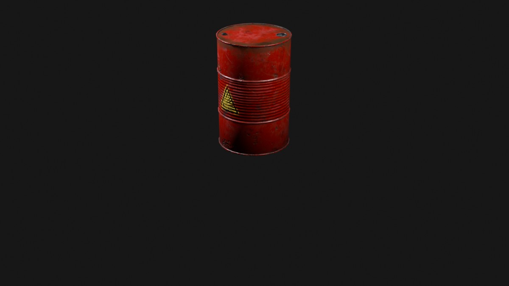

# DCC-MCP Poly Haven Assets

<p align="center">
  
</p>

## Agent workflow

AI agents should use installed package skills through the shared gateway. IDE
users may continue to use the MCP endpoint.

```bash
dcc-mcp-cli dcc-types
dcc-mcp-cli list
dcc-mcp-cli search --query "<task>" --dcc-type <host>
dcc-mcp-cli describe <tool-slug>
dcc-mcp-cli call <tool-slug> --json '{"key":"value"}'
```

If the package skill is not active, call
`dcc-mcp-cli load-skill <skill-name> --dcc-type <host>`. After the task,
query `dcc-mcp-cli stats --range 24h --session-id <task-id>` and pass only
bounded evidence to the `review_skill_improvement` prompt from
`dcc-mcp-skills-creator`.


Search and download CC0 assets from Poly Haven.

Poly Haven asks API clients to send a unique User-Agent. This skill does that
and keeps the implementation to simple search/list/download tools.

Downloads return a validated `asset_descriptor` with the preferred local file, Poly Haven source
URL, CC0 license, and dependency paths for a DCC adapter import skill.

## Example result



This image was produced through the real workflow: `download_polyhaven_asset`
downloaded `Barrel_01`, its `asset_descriptor` was passed to the Blender import
skill, and Blender rendered the result. The showcased asset is
[Barrel_01](https://polyhaven.com/a/Barrel_01) from Poly Haven, licensed under
[CC0 1.0](https://polyhaven.com/license).

## Install

```bash
dcc-mcp-cli marketplace add dcc-mcp/dcc-asset-polyhaven
dcc-mcp-cli marketplace install dcc-asset-polyhaven
```

## Tools

- `search_polyhaven_assets`
- `list_polyhaven_files`
- `download_polyhaven_asset`
